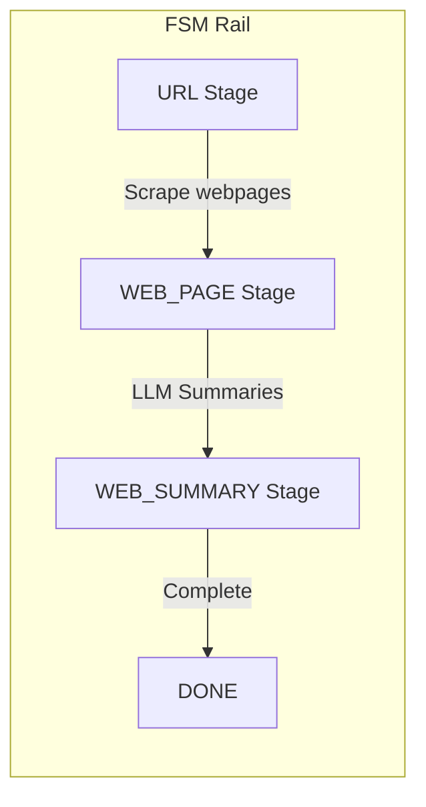
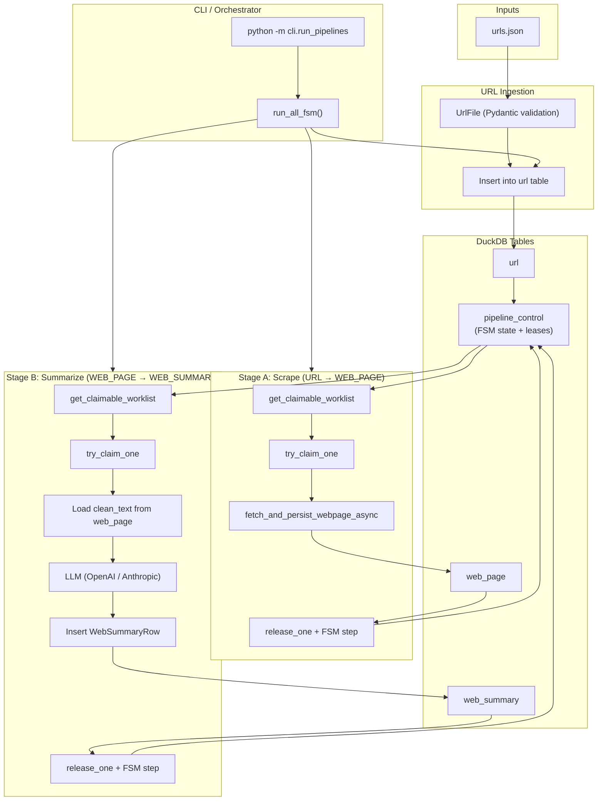
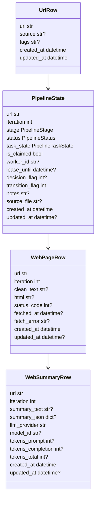
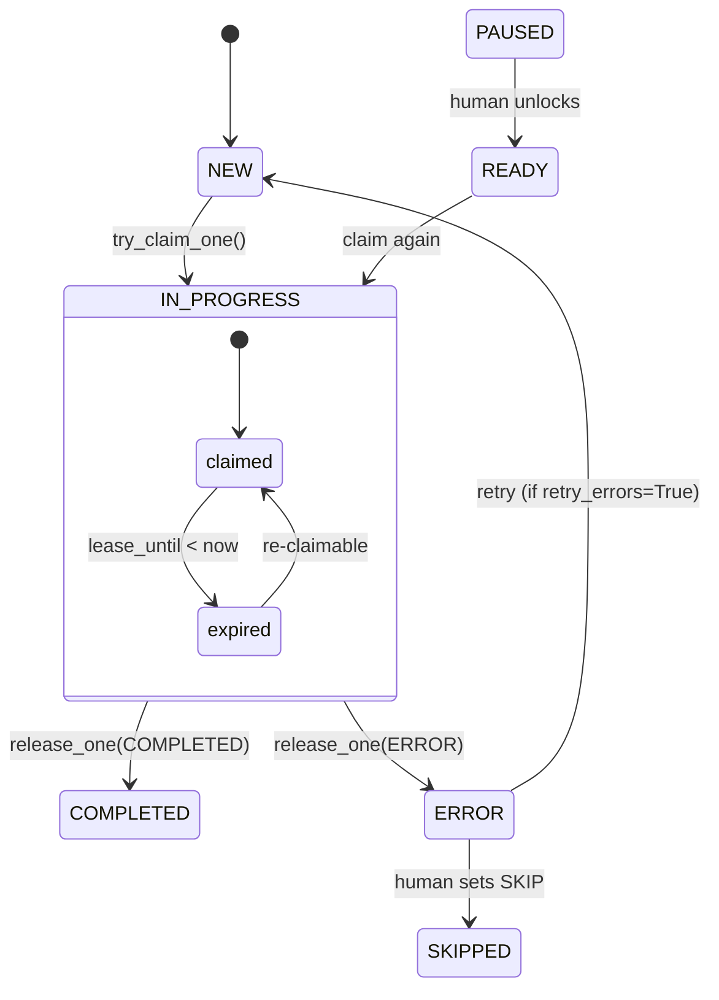
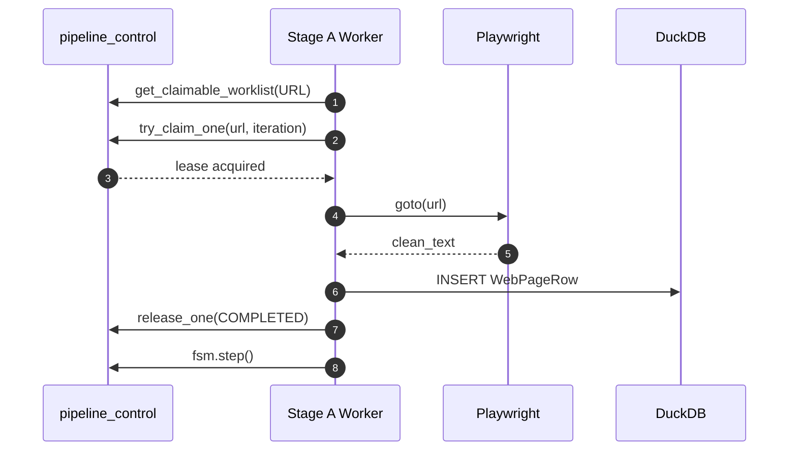
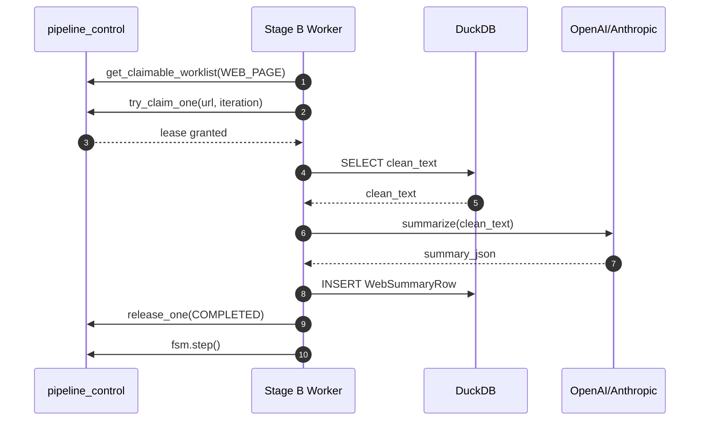
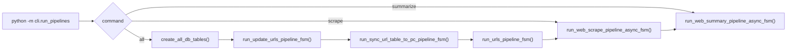

# **FSM-Driven Web Summary Demo**

*A fully asynchronous, DuckDB-backed, finite-state-machine-controlled web scraping + LLM summarization pipeline.*

---

## **Overview**

This project demonstrates:

### ✅ **Fully traceable multi-stage pipelines**

Driven by an explicit, ordered FSM rail:

> **URL → WEB_PAGE → WEB_SUMMARY → DONE**

Defined in `fsm_stage_config.py` and `pipeline_enums.py`.

### ✅ **DuckDB as the storage + control plane**

Four tables are defined in the central schema registry (`db_schema_registry.py`):

* `url`
* `pipeline_control`
* `web_page`
* `web_summary`

Each table has:

* a Pydantic model  
* explicit primary keys  
* authoritative column ordering  
* schema-aware ingestion and alignment  

### ✅ **Asynchronous, lease-aware processing**

All workers use:

* `try_claim_one()`
* `release_one()`
* `get_claimable_worklist()`

(from `db_utils.py`), ensuring:

* **only one worker processes a URL at a time**
* **crashed workers free leases automatically**
* **no stuck rows**

### ✅ **Two clear pipeline stages**

**Stage A: Web Scrape (URL → WEB_PAGE)**

* Playwright-based async scraping  
* Text cleaning  
* Insert into `web_page`  

Stored in `web_scrape_pipeline_async_fsm.py`.

---

**Stage B: LLM Summarize (WEB_PAGE → WEB_SUMMARY)**

* Load cleaned text  
* Send to OpenAI / Anthropic  
* Store JSON + text summary  

Stored in `web_summarize_pipeline_async_fsm.py`.

---

### ✅ **CLI Runner**

A rich command-line interface lets you run Stage A, Stage B, or both:

`cli/run_pipelines.py`

---

### ✅ **Complete Orchestrator**

For scripted one-shot runs, use:

`src/main.py`

---

# **Project Structure**

```text
fsm_llm_web_summary_demo/
├── README.md
├── pyproject.toml
├── uv.lock
├── logs/
├── pipeline_data/
│   ├── pipeline_data.duckdb                 # DuckDB database file
│   └──  urls.json                            # Seed URLs for the pipeline
│
└── src/
    ├── main.py                              # High-level orchestrator entrypoint
    │
    ├── cli/
    │   └── run_pipelines.py                 # CLI wrapper (python -m cli.run_pipelines)
    │
    ├── config/
    │   ├── db_inserters.yaml                # YAML config for insert behaviors
    │   ├── db_loaders.yaml                  # YAML config for table loaders
    │   ├── logging_config.py                # Central logging setup
    │   └── project_config.py                # Project root, DuckDB paths, LLM defaults
    │
    ├── db_io/
    │   ├── create_db.py                     # (Legacy/simple) DB creation helper
    │   ├── create_db_tables.py              # Idempotent DDL for all tables
    │   ├── db_inserters.py                  # Schema-aligned INSERT logic (YAML-driven)
    │   ├── db_loaders.py                    # Table loaders using db_loaders.yaml
    │   ├── db_schema_registry.py            # SST registry: models, PKs, column order
    │   ├── db_transform.py                  # add_metadata + model→DataFrame transforms
    │   ├── db_utils.py                      # Worklist, leases, FSM helpers, queries
    │   ├── file_ingestion.py                # urls.json → UrlFile → url table
    │   ├── get_db_connection.py             # Central DuckDB connection factory
    │   └── persist_pipeline_state.py        # Persist/refresh pipeline_control from FSM
    │
    ├── fsm/
    │   ├── fsm_stage_config.py              # Ordered rail: URL → WEB_PAGE → WEB_SUMMARY → DONE
    │   ├── pipeline_enums.py                # PipelineStage/Status/TaskState, LLMProvider, TableName
    │   ├── pipeline_fsm.py                  # Per-URL FSM implementation
    │   ├── pipeline_fsm_manager.py          # Manager: load/store FSM from pipeline_control
    │   └── state_sync.py                    # Sync FSM ↔ pipeline_control rows
    │
    ├── llm_api/
    │   ├── llm_api_utils_async.py           # Async wrappers for OpenAI/Anthropic APIs
    │   ├── llm_response_validators.py       # Validation → JSONResponse/TextResponse/etc
    │   └── prompt_templates_web.py          # Web summarization prompt templates
    │
    ├── models/
    │   ├── db_loaders_config_models.py      # Pydantic models for loader YAML config
    │   ├── db_table_models.py               # Pydantic models for DuckDB tables
    │   ├── llm_response_models.py           # JSONResponse, TextResponse, TabularResponse, CodeResponse
    │   ├── pydantic_model_loaders_for_files.py
    │   ├── url_file_models.py               # Url, UrlFile (seed JSON format)
    │   └── web_content_models.py            # WebPageContent, WebPageBatch, WebSummaryJSON
    │
    ├── pipelines/
    │   ├── advance_completed_to_next_stage.py
    │   ├── sync_url_table_to_pc_pipeline_fsm.py
    │   ├── update_urls_pipeline_fsm.py
    │   ├── urls_pipeline_fsm.py
    │   ├── web_scrape_pipeline_async_fsm.py
    │   ├── web_summarize_pipeline_async_fsm.py
    │   └── webpage_reader_async.py
    │
    ├── utils/
        └── find_project_root.py
````

---

# **DuckDB Schema**

Managed centrally via **`DUCKDB_SCHEMA_REGISTRY`**.

| Table              | Purpose                              | PK                                       |
| ------------------ | ------------------------------------ | ---------------------------------------- |
| `url`              | Canonical URL registry               | `url`                                    |
| `pipeline_control` | FSM state, machine lease, human gate | `url, iteration`                         |
| `web_page`         | Cleaned webpage text                 | `url, iteration`                         |
| `web_summary`      | LLM output (text + JSON + metadata)  | `url, iteration, llm_provider, model_id` |

All schema → strict Pydantic models in `db_table_models.py`.

### **Note on Token Usage Fields**

The `web_summary` table includes three optional columns related to LLM token usage:

* `tokens_prompt`
* `tokens_completion`
* `tokens_total`

These fields are present for **future expansion**, but the current demo does **not** extract or store token usage from OpenAI or Anthropic responses.
As a result, these columns will appear as `NULL` in DuckDB.

This simplifies the LLM wrapper code and keeps the demo focused on the core FSM-driven scraping + summarization workflow.

---

# **Quick Start**

This section shows how to run the **entire FSM-driven DuckDB pipeline** — from URL ingestion → webpage scraping → LLM summaries — in just a few commands.

---

## **1. Install Dependencies**

From the project root:

```bash
uv sync
```

Or, using pip:

```bash
pip install -e .
```

Install Playwright browsers:

```bash
playwright install
```

---

## **2. Prepare Your URL Seed File**

Edit:

```
pipeline_data/urls.json
```

Format is flexible:

```json
{
  "urls": [
    {
      "url": "https://example.com",
      "source": "manual",
      "tags": ["demo"]
    }
  ]
}
```

Or simply:

```json
[
  { "url": "https://example.com" },
  { "url": "https://wikipedia.org" }
]
```

---

## **3. Run the Full Pipeline (Scrape → Summarize)**

```bash
python -m cli.run_pipelines all
```

This performs:

1. Creates all DuckDB tables (idempotent).
2. Ingests `urls.json` → `url` table.
3. Syncs `url` → `pipeline_control`.
4. **Stage A:** Scrapes and cleans webpages.
5. **Stage B:** Summarizes via OpenAI/Anthropic.

Outputs stored in:

```
pipeline_data/pipeline_data.duckdb
```

---

## **4. View the Results**

```bash
duckdb pipeline_data/pipeline_data.duckdb
```

Then inside DuckDB:

```sql
SELECT * FROM web_page LIMIT 10;
SELECT * FROM web_summary LIMIT 10;
SELECT url, summary_text FROM web_summary ORDER BY created_at DESC;
```

---

## **5. Run Stages Individually**

### Stage A only:

```bash
python -m cli.run_pipelines scrape --max 5
```

### Stage B only:

Using OpenAI:

```bash
python -m cli.run_pipelines summarize --provider openai --model gpt-4.1-nano
```

Using Anthropic:

```bash
python -m cli.run_pipelines summarize --provider anthropic --model claude-3-haiku
```

Retry failed rows:

```bash
python -m cli.run_pipelines summarize --retry-errors
```

---

## **6. Advance Completed Rows**

```bash
python -m cli.run_pipelines advance-completed
```

---

## **7. Logs and Debugging**

All logs written to:

```
logs/<username>_YYYY-MM-DD_HH-MM-SS_app.log
```

Look for:

* Scrape errors
* Summarization errors
* FSM transitions
* Lease expirations

---

# **LLM Behavior**

Stage B uses structured JSON-based summarization via:

* `SUMMARIZE_WEBPAGE_TO_JSON_PROMPT`
* `JSONResponse` (in `llm_response_models.py`)
* `WebSummaryJSON` (validated JSON structure)

Human-readable text is synthesized via `_derive_summary_text`.

---

# **Lease / FSM Logic**

Provided by:

* `get_claimable_worklist`
* `try_claim_one`
* `renew_lease`
* `release_one`

FSM transitions follow the rail in `fsm_stage_config.py`.

Each stage pipeline enforces:

* Stage-gate checks
* Lease semantics
* `fsm.step()` after success

---

# **Configuration**

All configs live in `config/project_config.py`.

Key fields:

* `DUCKDB_FILE`
* `URL_JSON_FILE`
* `GPT_4_1_NANO`, `CLAUDE_HAIKU`
* Provider constants `{OPENAI, ANTHROPIC}`

---

# **Extending the Pipeline**

You can extend this architecture to:

* Add new pipeline stages
* Add new DuckDB tables
* Add batch LLM processing
* Run parallel workers
* Integrate background jobs

To add a new stage:

1. Add a `PipelineStage` enum
2. Add it to `PIPELINE_STAGE_SEQUENCE`
3. Create a new stage pipeline file
4. Add a table + Pydantic model
5. Register it in `DUCKDB_SCHEMA_REGISTRY`

Everything else “just works.”

---

# **Appendix: Key Design Principles**

### **Single Source of Truth**

All schema definitions and column ordering live in `db_schema_registry.py`.

### **Strict Pydantic Validation**

Every DB row is validated on read/write.

### **Idempotency**

Re-running stages is safe via dedup logic in `db_inserters.py`.

### **Concurrency + Fault Tolerance**

Async workers + leases prevent double work; expired leases allow recovery.

### **Separation of Responsibilities**

Stage A = scraping & cleaning
Stage B = summarization

---

# **Appendix: Architecture Diagrams**

## **1. High-Level FSM Pipeline Overview**



---


## **2. Full System Architecture (End-to-End)**



---

## **3. DuckDB Schema + Pydantic Model Layer**



---

## **4. Lease + Human-Gate State Machine**



---

## **5. Stage A (Async Web Scraping)**



---

## **6. Stage B (LLM Summarization)**



---

## **7. Control-Plane Interaction**



---

## **8. CLI Execution Flow**


---

# **License**

MIT License
